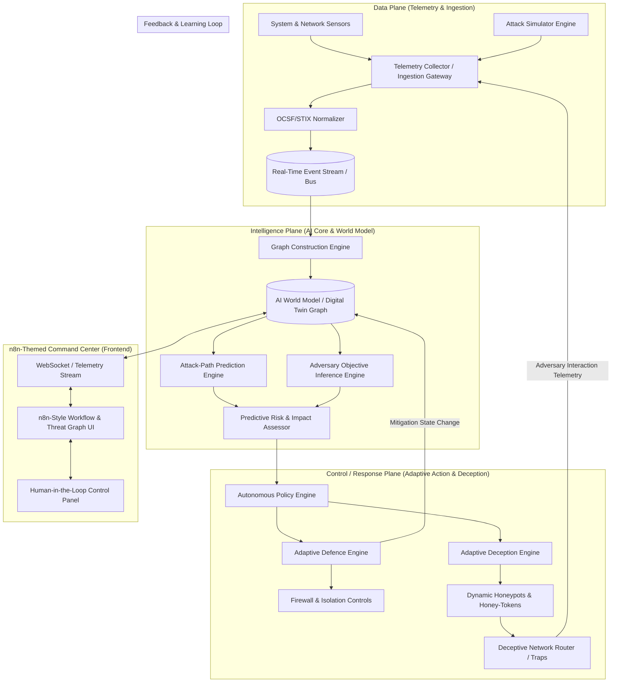

# 🛡️ System Architecture: Autonomous AI Cybersecurity & Adaptive Deception Platform

## 1. Executive Summary & Core Paradigm

This document specifies the technical architecture for an **Autonomous AI Cybersecurity and Adaptive Deception Platform**. The platform operates on a closed-loop cyber-defense paradigm that shifts defense from static, reactive rule-matching to an active, predictive, and deceptive counter-engagement framework.

The architecture is divided into three primary functional planes:
1. **Data Plane**: Ingestion, normalization, enrichment, and routing of system/network telemetry.
2. **Intelligence Plane**: Graph-based AI World Model, Attack-Path Prediction, Adversary Objective Inference, and Risk Scoring.
3. **Control / Response Plane**: Adaptive Countermeasures, Automated Mitigation, Dynamic Deception Generation (honeypots, honey-tokens, fake network topologies), and Closed-Loop Feedback.

---

## 2. High-Level System Architecture Diagram



---

## 3. Deep-Dive: Architectural Planes

### 3.1 Data Plane
The Data Plane handles high-throughput telemetry ingestion, schema normalization, and stream distribution.

* **Telemetry Sources**: System logs (Syslog, Auditd), Network flows (NetFlow, PCAP metadata), EDR signals (process trees, file mutations), and synthetic attack vectors.
* **Schema Normalization**: Converts raw telemetry into OCSF (Open Cybersecurity Schema Framework) and STIX 2.1 format for unified processing.
* **Event Bus**: In-memory event bus (Redis Pub/Sub or Python Async Broadcast) ensuring low-latency (<50ms) event delivery to the Intelligence Plane.

### 3.2 Intelligence Plane
The Intelligence Plane provides deep situational awareness and predictive adversary modeling.

* **AI World Model (Digital Twin)**:
  * Graph database structure (Nodes = Hosts, Users, Services, Data Assets, Vulnerabilities; Edges = Connections, Privileges, Trust Boundaries).
  * Real-time state updates based on incoming telemetry.
* **Attack-Path Prediction Engine**:
  * Utilizes graph traversal (Dijkstra / A* path scoring) and Bayesian attack-graph modeling to identify probable lateral movement vectors.
  * Calculates choke points where single defensive interventions block maximum potential attack vectors.
* **Adversary Objective Inference**:
  * Maps observed TTPs (Tactics, Techniques, and Procedures) against the **MITRE ATT&CK Framework**.
  * Employs probabilistic intent models to estimate the attacker's ultimate crown-jewel target (e.g., Database exfiltration vs. Ransomware deployment).

### 3.3 Control / Response Plane
The Control Plane translates intelligence into dynamic, real-time countermeasures.

* **Adaptive Defence Engine**:
  * Automated asset isolation, IP blocking, session revocation, and dynamic rate-limiting.
* **Adaptive Deception Engine**:
  * **Dynamic Honey-Tokens**: Synthetic API keys, database credentials, and session tokens injected into process memory and filesystem traps.
  * **Dynamic Decoys**: On-demand spin-up of lightweight containerized honeypots mimicking high-value targets.
  * **Deceptive Topology**: Redirection of malicious traffic into isolated sandbox networks where adversary actions are recorded without impacting production assets.

---

## 4. Telemetry Pipeline & Feedback Loop

```
[Attacker Action] ➔ [Sensor Telemetry] ➔ [Normalizer] ➔ [AI World Model Graph Update]
       ▲                                                                │
       │                                                                ▼
[Deception Trap Interaction] ◄── [Adaptive Deception Action] ◄── [Prediction & Response Engine]
```

1. **Detection & Ingestion**: Attacker interacts with system; telemetry captured in Data Plane.
2. **Graph Contextualization**: Telemetry updates node risk score in AI World Model.
3. **Predictive Evaluation**: Path Predictor identifies attacker is 2 hops away from sensitive database.
4. **Deception Injection**: Response Plane deploys fake credentials (`prod_db_backup.key`) and dynamic decoy DB on port `5433`.
5. **Adversary Engagement**: Attacker attempts connection to decoy DB using honey-token.
6. **Feedback Loop**: Interaction confirms malicious intent with 100% confidence, immediately triggering automated isolation of attacker IP while keeping them detained in the decoy trap.

---

## 5. Security Controls at Every Layer

* **Data Layer**: Encrypted event streaming (mTLS/TLS 1.3), hashed sensor tokens.
* **API Layer**: JWT authentication, RBAC (Role-Based Access Control), rate limiting.
* **AI Model Security**: Guardrails against prompt injection / adversarial input manipulation in inference models.
* **Response Layer**: Human-in-the-Loop (HITL) approval toggles for high-impact actions (e.g. whole-subnet shutdown), cryptographic verification of mitigation commands.
* **Deception Isolation**: Strict container namespace isolation and virtual network firewall rules ensuring decoy traps cannot reach real production networks.

---

## 6. Frontend Architecture (n8n Visual Theme)

The UI will be built as an **n8n-themed Interactive Autonomous Command Center**:
* **Aesthetic**: Obsidian dark canvas background (`#0F1117`), n8n Coral accents (`#FF6D5A`), cyan status nodes (`#00D4B2`), and purple link wires (`#7057FF`).
* **Visual Graph Canvas**: Node-based rendering of the enterprise infrastructure graph, active threats, and response node workflows.
* **Real-time Live Stream**: WebSocket-driven event ticker, interactive attack path visualizer, and instant mitigation trigger panels.
