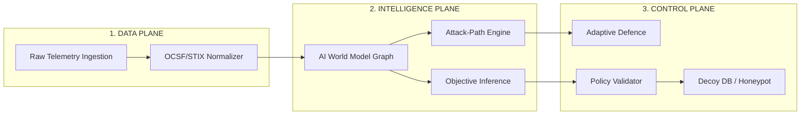

# 🛡️ CHRONOS-WS — Judge Presentation & Walkthrough Guide

### Product Vision: **Predict. Defend. Deceive.**

This document serves as the official pitch script, architecture guide, and evaluation walkthrough for presenting **CHRONOS-WS** to hackathon judges and technical evaluators.

---

## 🎯 60-Second Elevator Pitch Script

> **"Judges, current SOC defenses are fundamentally reactive—they wait for an attacker to break a rule before triggering an alert. By then, it's often too late.**
>
> **Introducing CHRONOS-WS. We have shifted defense from static rule-matching to an Autonomous, Predictive, and Deceptive Counter-Engagement Platform.**
>
> **CHRONOS-WS doesn't just log attacks; it uses an AI World Model to forecast where the attacker will move next ($S_{t+1}$), infers their hidden objective, dynamically reroutes traffic via a security-aware load balancer, and traps them in isolated Honeypot Decoy Zones—keeping production assets 100% safe while capturing attacker intent."**

---

## 🏛️ System Architecture: The 3 Planes



1. **Data Plane (Ingestion)**: Normalizes raw telemetry (Syslog, NetFlow, PCAP) into standard OCSF/STIX formats with low-latency streaming (<50ms).
2. **Intelligence Plane (Predictive Engine)**:
   - **AI World Model (Digital Twin)**: Graph model tracking network topology, asset states, and vulnerability nodes.
   - **Attack-Path Prediction Engine**: Graph traversal (Dijkstra/Bayesian) forecasting lateral movement vectors 30s into the future.
   - **Objective Inference Engine**: Probabilistic Bayesian model estimating adversary targets (e.g., Credential Harvesting vs. Database Exfiltration).
3. **Control / Response Plane (Countermeasures & Deception)**:
   - **Policy Validator (`POL-001`)**: Enforces safety guardrails so autonomous actions cannot break production.
   - **Security-Aware Load Balancer**: Dynamically drops traffic weights on compromised nodes.
   - **Adaptive Deception Zone**: Spins up isolated decoy databases (e.g., Honey DB on Port 5433 / VLAN 99) to trap attackers.

---

## 🎬 Live 30-Second Judge Presentation & 11-Step Demo Script

Click **`TRIGGER DETERMINISTIC DEMO`** on the top bar or dashboard to run the fixed-seed (`seed=42`) 11-step simulation:

| Step / Phase | System Activity | Presentation Script for the Judge |
|---|---|---|
| **Phase 1–3: Observation** | Telemetry change & anomaly detection. | *"Notice baseline normal operation. Suddenly, an anomaly occurs: 12 failed logins in 2.4s from untrusted IP `192.168.99.150`."* |
| **Phase 4–6: Prediction & Intent** | AI World Model forecasts $S_{t+1}$. | *"Our AI World Model forecasts future threat state $S_{t+1}$ with 87% confidence, predicting lateral movement toward the DB. Objective Engine identifies Credential Access risk rising to 78%."* |
| **Phase 7–8: Dynamic Response** | Adaptive Defence & Load Balancer rerouting. | *"Instead of shutting down servers, our Load Balancer automatically reduces Server B's weight from 33% to 10%, isolating traffic without causing downtime."* |
| **Phase 9–10: Deception Trap** | Decoy DB activated on Port 5433 (VLAN 99). | *"CHRONOS-WS spins up an isolated Decoy Database on Port 5433. The attacker is tricked into exfiltrating synthetic data from the trap, while the real PostgreSQL DB remains at ZERO risk."* |
| **Phase 11: Feedback Loop** | Telemetry feedback updates network state. | *"Attacker payload is logged, system feedback loops into the World Model, lowering real asset risk back to LOW."* |

---

## 🖼️ Screen-by-Screen Navigation Map

1. **`/dashboard` (Command Center)**: High-level SOC Overview with **Current Situation Card**, **Workflow Stepper** (`OBSERVE` $\to$ `FEEDBACK`), and **Live Narrative Ticker**.
2. **`/network` (Network & Defense)**: Node Topology Canvas showing host health, CPU/Memory load, 9-Layer Defense Matrix, and Load Balancer allocation.
3. **`/ai` (AI & Predictions)**: Temporal prediction card ($S_t \to S_{t+1}$) and Bayesian Objective Inference probabilities ($P(\text{Creds}), P(\text{DB}), P(\text{Admin})$).
4. **`/attack-path` (Attack Path)**: Interactive graph mapping observed TTPs to MITRE ATT&CK tactics with explicit status badges (`COMPLETED`, `PREDICTED`, `DECEIVED`).
5. **`/defence` (Adaptive Defence)**: Multi-action execution pipeline: `RECOMMENDED` $\to$ `POLICY VALIDATED` $\to$ `EXECUTING` $\to$ `ACTIVE`.
6. **`/deception` (Deception Zone)**: Hard visual boundary separating Real Production Assets from VLAN 99 Decoy Traps.
7. **`/reports` (Analytics Reports)**: Before $\to$ After Comparative Metrics summary (e.g. Risk `42% → 78%`, Server B Traffic `34% → 10%`, Real DB Risk `High → Low`).

---

## 🛡️ Judge FAQ Cheat Sheet

> **Q1: "How do you prevent the honeypot/decoy from compromising production network assets?"**  
> **Answer**: *"Decoys run inside isolated virtual network containers on dedicated subnets (VLAN 99) with strict one-way ACL guardrails. Decoys can ingest attacker connections but have zero routing pathways back to internal production databases."*

> **Q2: "What prevents the AI model from making incorrect autonomous decisions?"**  
> **Answer**: *"We implement Stage 12 Guardrails—a dedicated Policy Validator Engine (`POL-001`). Every LLM/Model recommendation must pass policy authorization gates before execution. High-impact operations can also be set to Human-in-the-Loop (HITL) manual approval mode."*

> **Q3: "How does this handle high telemetry load without performance degradation?"**  
> **Answer**: *"Our Data Plane normalizes events into standard OCSF schemas and streams via an asynchronous FastAPI/WebSocket pipeline with an in-memory event bus, maintaining sub-50ms latency."*

> **Q4: "Is the demo repeatable for testing?"**  
> **Answer**: *"Yes! We built a 100% deterministic scenario controller using seed `42`, allowing any evaluator to reproduce the entire attack-prediction-deception sequence reliably."*

---

## 🧪 Verification & Testing Commands

- **Backend Pytest Suite**:
  ```bash
  cd backend
  PYTHONPATH=. ../venv/bin/pytest app/tests
  ```
- **Frontend Production Build**:
  ```bash
  cd frontend
  npm run build
  ```
